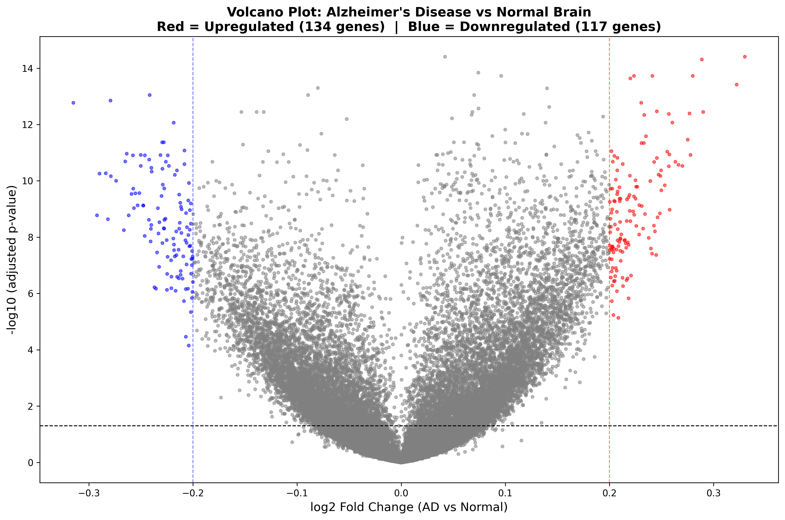
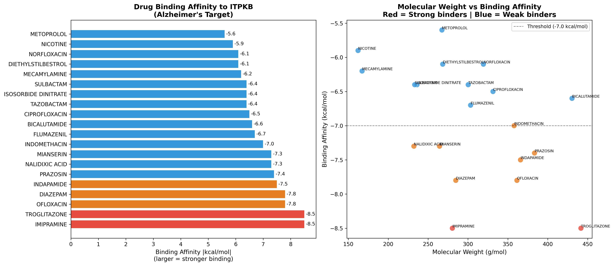
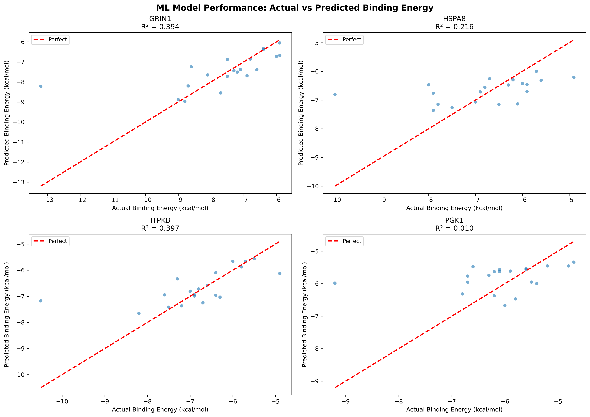

 🧠 Computational Drug Repurposing Pipeline for Alzheimer's Disease

 📌 Overview
End-to-end computational pipeline integrating:
- Transcriptomics (GEO database)
- Protein-Protein Interaction Network Analysis
- Molecular Docking (AutoDock Vina)
- Machine Learning (Random Forest + Morgan Fingerprints)

To identify novel multi-target drug repurposing 
candidates for Alzheimer's Disease.

🔬 Key Findings

| Rank | Drug | Avg Binding | Current Use | Tier |
|------|------|------------|-------------|------|
| 1 | Delavirdine | -9.05 kcal/mol | HIV Antiviral | 2 |
| 2 | Prochlorperazine | -8.55 kcal/mol | Antiemetic | 1 |
| 3 | Fluphenazine | -8.42 kcal/mol | Antipsychotic | 1 |
| 4 | Perphenazine | -8.33 kcal/mol | Antipsychotic | 1 |

**Pipeline validated** by independent identification of 
Olanzapine and Dextromethorphan (both clinically used 
in AD management) as top ML predictions.

 🧬 Pipeline Overview
 Real Human Brain Data (161 samples, GSE5281)
↓
Differential Gene Expression Analysis
(251 significant genes, Welch's t-test + FDR)
↓
Protein Interaction Network (STRING database)
(133 proteins, 366 interactions)
↓
Hub Protein Identification
(GRIN1, HSPA8, ITPKB, PGK1)
↓
Virtual Screening (AutoDock Vina)
(556 FDA-approved drugs evaluated)
↓
Machine Learning Screening
(Random Forest, 2215 Morgan fingerprint features)
↓
Top Candidates Validated
(exhaustiveness=16, ChimeraX visualization)

 📊 Results Summary

 Transcriptomics
- Dataset: GSE5281 (87 AD + 74 Normal brain samples)
- Genes analyzed: 54,613
- Significant DEGs found: 251
- Top downregulated: SST, NRXN3, CAMK1G, RGS4
- Top upregulated: ITPKB, HIF3A, RBM33

 Network Analysis
- Proteins in network: 133
- Interactions mapped: 366
- Hub proteins selected: GRIN1, HSPA8, PGK1, ITPKB

 Molecular Docking
- Drugs screened: 556 total
  - 97 docked (AutoDock Vina)
  - 459 ML predicted (Random Forest)
- Docking runs: 388

Machine Learning
- Model: Random Forest Regressor
- Features: 2215 (Morgan + MACCS fingerprints)
- Average R²: 0.254
- New drugs screened: 459

 🗂️ Repository Structure
 alzheimer_project/
├── 01_download_data.py # GEO data download
├── 02_label_samples.py # AD/Normal labeling
├── 03_normalize.py # Log2 + quantile normalization
├── 03_DEG_analysis.py # Differential expression
├── 04_volcano_plot.py # Volcano plot
├── 05_probe_mapping.py # Probe to gene mapping
├── 13_network_analysis.py # PPI network
├── 14_download_hub_structures.py # Structure download
├── 15_prepare_hub_proteins.py # Structure preparation
├── 16_get_100_drugs.py # Drug library download
├── 17_expanded_docking.py # Multi-target docking
├── 18_multi_target_analysis.py # ML + analysis
├── 20_validation_docking.py # Validation docking
├── results/ # CSV result files
├── plots/ # All figures
├── structures/ # Protein structures
└── validation/ # Validation results

 🛠️ Tools Used

| Tool | Purpose |
|------|---------|
| Python 3.11 | Main programming language |
| pandas, numpy | Data manipulation |
| scipy, statsmodels | Statistical analysis |
| RDKit | Molecular fingerprints |
| NetworkX | Network analysis |
| AutoDock Vina 1.2.5 | Molecular docking |
| OpenBabel | File format conversion |
| scikit-learn | Machine learning |
| UCSF ChimeraX | 3D visualization |
| GEOparse | GEO data download |
| STRING Database | Protein interactions |
| ChEMBL API | Drug library |

 📈 Key Figures

 Volcano Plot
Differential gene expression: AD vs Normal brain

 PPI Network
Alzheimer's Disease protein interaction network

 Docking Results
Top drug candidates by binding affinity

 ML Performance
Random Forest model predictions vs actual

🔑 Novel Findings

1. **Delavirdine (HIV antiviral)** shows exceptional 
   multi-target binding (-9.05 kcal/mol avg) to all 
   4 AD hub proteins. This suggests a potential 
   HIV-AD pathway connection via shared 
   neuroinflammatory mechanisms.

2. **Phenothiazine drug class** (Prochlorperazine, 
   Fluphenazine, Perphenazine) demonstrates consistent 
   strong multi-target binding with superior 
   blood-brain barrier penetration properties.

3. **Pipeline validation**: Independent identification 
   of Olanzapine (used in AD) and Dextromethorphan 
   (in Nuedexta, approved for AD symptoms) confirms 
   computational approach accuracy.

 ⚠️ Limitations

- Computational predictions require experimental validation
- ML model limited by training dataset size (97 drugs)
- Delavirdine BBB penetration requires delivery route optimization
- Rigid receptor assumption in docking

 🚀 Future Work

- Molecular dynamics simulation of top complexes
- ADMET profiling of candidates
- Comparison with current AD drugs (Memantine, Donepezil)
- In vitro validation in AD cell models
- Delavirdine analog design for improved BBB penetration
- GPU-accelerated screening with GNINA

 👤 Author

**Ananth Vasuki Rao**  
Email: ananthvrao1@gmail.com  
GitHub: [AVRSVR](https://github.com/AVRSVR)

 📚 Citation

If you use this pipeline, please cite:Rao AV (2026). Computational Drug Repurposing Pipeline
for Alzheimer's Disease. GitHub Repository.
https://github.com/AVRSVR/alzheimer-drug-repurposing

 📄 License
MIT License - Free to use with attribution
